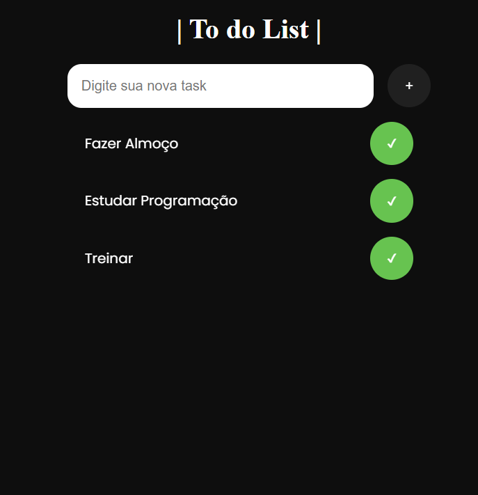

# Readme.Github

# To Do List

## 📱Descrição do projeto

### Esse projeto se trata de uma To Do List (Lista de afazeres em português).
### As informações a respeito da Task ficam armazenadas no localStorage, isso significa que mesmo que o usuário saia da página ou recarregue a página, o programa continuará carregando as informações que esse usuário inseriu anteriormente.
### A ideia do projeto foi tirada de um dos vídeos do canal "Gustavo Neitzke", mas o código em Javascript, HTML e CSS foi desenvolvivo por mim.

http://img.shields.io/static/v1?label=STATUS&message=EM%20DESENVOLVIMENTO&color=GREEN&style=for-the-badge

## 🎯Proposta do projeto

### Com essa To Do List o usuário conseguirá se organizar melhor para realizar as tarefas do dia a dia. Podendo Adicionar e marcar as Tasks como concluídas quando bem entender.

## 🔨Funcionalidades da aplicação web - RFs

- `Funcionalidade 1`: Adicionar Tasks na lista
- `Funcionalidade 2`: Remover Tasks da lista
- `Funcionalidade 3`: Impedir de adicionar uma Task que já existe na lista
- `Funcionalidade 4`: Alertar quando o usuário tentar adicionar uma Task sem antes ter escrito algo no input

## ✔️Tecnologias utilizadas

- `HTML`
- `CSS`
- `JavaScript`

## 
📱Interface

